# MACT CMS — Entity Relationship Diagram

Generated from [`apps/api/prisma/schema.prisma`](../apps/api/prisma/schema.prisma).
Renders natively on GitHub. `||` = one, `o{` = many, `o|` = optional one.

```mermaid
erDiagram
    User ||--o{ CaseAssignee : "assigned to"
    User ||--o{ Case : "leads"
    User ||--o{ Hearing : "records"
    User ||--o{ Document : "uploads"
    User ||--o{ FeePayment : "records"
    User ||--o{ AuditLog : "acts"
    User ||--o{ Notification : "receives"

    Court ||--o{ Case : "hears"
    Court ||--o{ Judge : "seats"
    InsuranceCompany ||--o{ Insurance : "issues"
    InsuranceCompany ||--o{ Respondent : "is respondent"
    PoliceStation ||--o{ AccidentDetail : "registers"
    Hospital ||--o{ MedicalDetail : "treats at"

    Case ||--o| ClaimPetition : "has"
    Case ||--o| AccidentDetail : "has"
    Case ||--o| FeeArrangement : "has"
    Case ||--o{ Claimant : "has"
    Case ||--o{ Victim : "has"
    Case ||--o{ Vehicle : "involves"
    Case ||--o{ Respondent : "has"
    Case ||--o{ Witness : "has"
    Case ||--o{ MedicalDetail : "has"
    Case ||--o{ Hearing : "has"
    Case ||--o{ Document : "has"
    Case ||--o{ CompensationEstimate : "has"
    Case ||--o{ CaseAssignee : "has"
    Case ||--o{ Activity : "logs"
    Case ||--o{ Notification : "triggers"

    Vehicle ||--o| Driver : "driven by"
    Vehicle ||--o| Owner : "owned by"
    Vehicle ||--o| Insurance : "insured by"

    FeeArrangement ||--o{ FeePayment : "receives"
    Hearing ||--o| Document : "order copy"

    Case {
        string id PK
        string caseRef UK "MACT-2026-00042"
        string mactCaseNumber
        string courtId FK
        datetime nextHearingDate
        enum status
        enum stage
        enum priority
        string leadAdvocateId FK
    }
    ClaimPetition {
        string caseId FK,UK
        string petitionNumber
        decimal claimAmount
        decimal compensationAwarded
        decimal interestRate
        datetime awardDate
    }
    Claimant {
        string caseId FK
        string name
        string guardianName
        string aadhaar
        decimal monthlyIncome
        string bankAccountNo
    }
    Victim {
        string caseId FK
        enum type "DECEASED|INJURED"
        int age
        decimal monthlyIncome
        decimal disabilityPct
        datetime dateOfDeath
    }
    AccidentDetail {
        string caseId FK,UK
        datetime accidentDate
        decimal latitude
        decimal longitude
        string firNumber
        string policeStationId FK
    }
    Vehicle {
        string caseId FK
        enum role
        string registrationNo
        string chassisNumber
        string engineNumber
    }
    Driver {
        string vehicleId FK,UK
        string licenceNumber
        datetime licenceValidity
        string licenceCategory
    }
    Owner {
        string vehicleId FK,UK
        string aadhaar
        string pan
    }
    Insurance {
        string vehicleId FK,UK
        string insuranceCompanyId FK
        string policyNumber
        datetime policyExpiryDate
        bool isThirdParty
    }
    Respondent {
        string caseId FK
        enum type
        string insurerId FK
    }
    Witness {
        string caseId FK
        enum type
        string statement
    }
    MedicalDetail {
        string caseId FK
        string hospitalId FK
        string mlcNumber
        decimal disabilityPct
        decimal totalMedicalBills
    }
    Hearing {
        string caseId FK
        datetime hearingDate
        enum status
        string proceedings
        datetime nextHearingDate
        string orderDocumentId FK,UK
    }
    Document {
        string caseId FK
        enum category
        string storageKey
        string[] tags
        string checksum
    }
    FeeArrangement {
        string caseId FK,UK
        enum feeType
        decimal fixedAmount
        decimal percentage
        decimal agreedAmount
    }
    FeePayment {
        string feeId FK
        decimal amount
        enum paymentMode
        string receiptNumber UK
    }
    CompensationEstimate {
        string caseId FK
        int age
        decimal monthlyIncome
        int multiplier
        decimal totalCompensation
        json breakdown
    }
    AuditLog {
        string userId FK
        enum action
        string entity
        json before
        json after
    }
```

## Cardinality cheatsheet

- **Case 1—1 ClaimPetition / AccidentDetail / FeeArrangement** — single petition,
  accident record, and fee deal per case.
- **Case 1—N Claimant / Victim / Vehicle / Respondent / Witness / Hearing /
  Document / CompensationEstimate** — all support multiples per requirement.
- **Vehicle 1—1 Driver / Owner / Insurance** — each offending vehicle pleads its
  own trio (the classic MACT driver–owner–insurer liability chain).
- **FeeArrangement 1—N FeePayment** — installment receipts roll up to one deal.
- **User 1—N Case (lead)** + **M—N Case (CaseAssignee)** — one lead advocate, many
  juniors/staff assigned.

## Index strategy

Hot query paths are indexed: `Case(status, stage, priority, nextHearingDate,
leadAdvocateId, mactCaseNumber)`, `Hearing(hearingDate, status)`,
`Insurance(policyExpiryDate)` (expiry reminders), `Document.tags` (GIN, tag
search), and `AuditLog(entity, entityId, createdAt)`.
